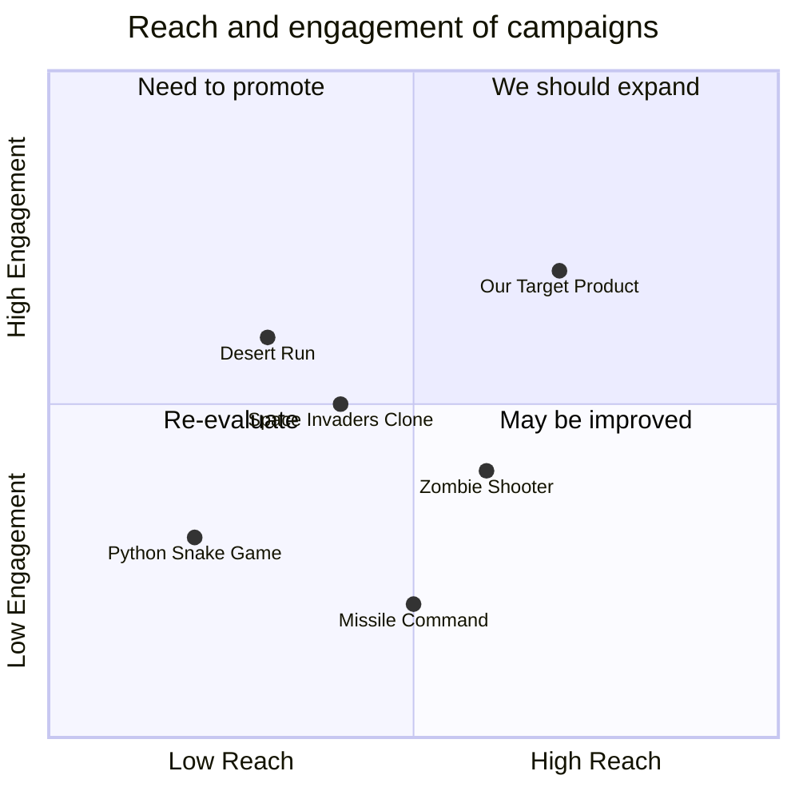

## Original Requirements
We aim to develop a 2D side-scrolling shooter game in Python. The game is set in a desert environment at night, with a frantic and fast-paced atmosphere. The player controls a character that automatically moves upwards on a road filled with zombies and obstacles. The character, positioned at the bottom of the screen, can only move left and right using the keyboard. The character holds a gun that automatically launches 20 missiles every second, each missile capable of killing a zombie with one hit. If the player touches a zombie, the game pauses and displays a "game over" message. The player's score is determined by the number of zombies killed. Obstacles on the road have life points ranging from 10 to 20. If an obstacle is destroyed by the player, the player's missile shooting speed doubles. Zombies and obstacles appear randomly at the top of the screen as the game progresses. The game assets provided include "player.png", "obstacle.png", "zombie.png", "missile.png", "gun.png", and "background.png".

## Product Goals
```python
[
    "Create a fast-paced, 2D side-scrolling shooter game in Python",
    "Ensure smooth control of the player character and effective collision detection",
    "Implement a scoring system based on the number of zombies killed"
]
```

## User Stories
```python
[
    "As a player, I want to be able to move my character left and right to avoid zombies and obstacles",
    "As a player, I want my character to automatically shoot missiles so I can focus on dodging and aiming",
    "As a player, I want to be able to destroy obstacles to increase my shooting speed",
    "As a player, I want the game to end when a zombie touches my character, so I am motivated to avoid them",
    "As a player, I want my score to be based on the number of zombies I kill, so I am motivated to aim accurately"
]
```

## Competitive Analysis
```python
[
    "Python Snake Game: A simple game with smooth controls but lacks the fast-paced action and shooting mechanics of our game",
    "Space Invaders Clone: Features shooting mechanics and enemy avoidance but lacks the side-scrolling and obstacle mechanics of our game",
    "Zombie Shooter: A game with similar theme but lacks the automatic movement and obstacle mechanics of our game",
    "Desert Run: A game with similar environment but lacks the shooting and zombie elements of our game",
    "Missile Command: Features missile shooting but lacks the side-scrolling, zombie, and obstacle mechanics of our game"
]
```

## Competitive Quadrant Chart


## Requirement Analysis
The product should be a fast-paced, 2D side-scrolling shooter game. The player should be able to control the character's movement, shoot missiles automatically, destroy obstacles to increase shooting speed, and score points by killing zombies. The game should end when a zombie touches the player's character.

## Requirement Pool
```python
[
    ("Implement player character's left and right movement", "P0"),
    ("Implement automatic missile shooting", "P0"),
    ("Implement collision detection for zombies and missiles", "P0"),
    ("Implement scoring system based on number of zombies killed", "P0"),
    ("Implement game over condition when player touches a zombie", "P0")
]
```

## UI Design draft
The game screen should be divided into two main areas: the game area and the score area. The game area occupies most of the screen and displays the player character, zombies, obstacles, and missiles. The player character is positioned at the bottom, and zombies and obstacles appear at the top. The score area is located at the top right corner and displays the current score. The game assets provided should be used to represent the player character, zombies, obstacles, and missiles.

## Anything UNCLEAR
There are no unclear points.