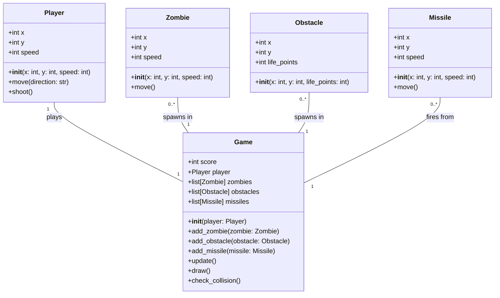
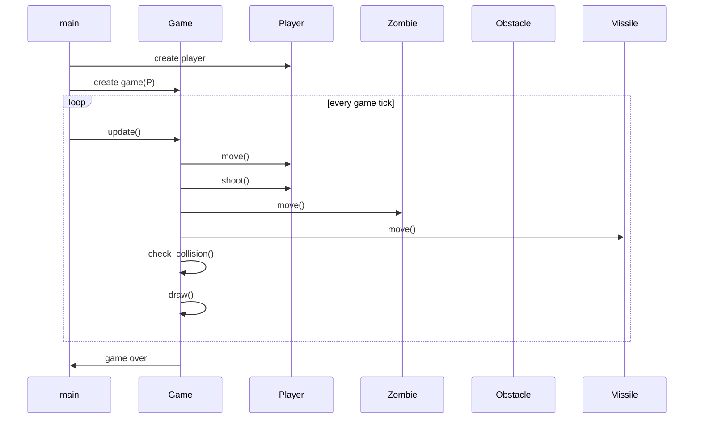

## Implementation approach
We will use the Pygame library, which is an open-source module for Python designed for making video games. It provides functionalities such as graphics, sound, and input handling which are essential for game development. The challenging part of this project will be implementing the collision detection between the player, zombies, missiles, and obstacles. We will also need to manage the game state, such as the player's score and the game over condition.

## Python package name
```python
"zombie_shooter"
```

## File list
```python
[
    "main.py",
    "player.py",
    "zombie.py",
    "obstacle.py",
    "missile.py",
    "game.py"
]
```

## Data structures and interface definitions


## Program call flow


## Anything UNCLEAR
The requirement is clear to me.